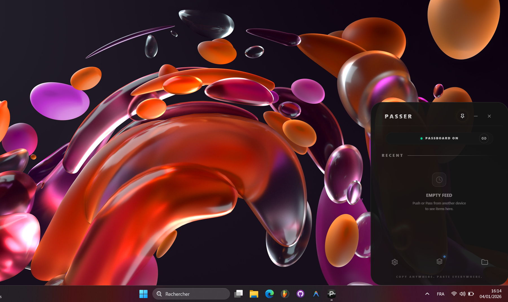

<align align="center">
  
  <h1>Passer</h1>
  <p><b>The seamless bridge between your iPhone and PC.</b></p>

  [](https://tauri.app/)
  [](https://react.dev/)
  [](https://vitejs.dev/)
  [](https://www.typescriptlang.org/)
</align>

---

**Passer** is a ultra-fast, cross-device clipboard and file transfer utility designed for maximum productivity. It bridges the gap between **Windows and iOS**, allowing you to sync your workflow across your devices instantly.

<p align="center">
  
</p>

## 📱 iPhone ↔️ PC Workflow (iOS Shortcuts)

Passer leverages **iOS Shortcuts** to provide a deeply integrated experience on your iPhone:

- **📤 Push**: Send anything from your iPhone (Clipboard, Files, Photos, Text) directly to your PC.
- **📥 Pull**: Retrieve your PC's current clipboard and save it to your iPhone instantly.
- **🔗 Pass**: Send content to your PC directly from the **Apple Share Sheet** in any app.

### 🔗 Get the iOS Shortcuts
*Add these shortcuts to your iPhone to start passing:*
- [x] [**Push Shortcut**](https://www.icloud.com/shortcuts/dd0caf23b72042beb73ed2b4f175477c)
- [x] [**Pull Shortcut**](https://www.icloud.com/shortcuts/4293d6e1253249efa1b6401f4648641e)
- [x] [**Pass Shortcut**](https://www.icloud.com/shortcuts/6a6fa41ddc2a452cb19b9f245b1709e6)

---

## ✨ Key Features

- **⚡ Instant Sync**: Copy on PC, paste on iPhone (or vice versa) over your local network.
- **📁 Passer Space**: A local WebDAV server that turns your PC into a wireless shared drive for your iPhone.
- **💎 Premium UX**: A sleek, glassmorphic Windows interface that docks at the bottom-right of your screen.
- **🛡️ Privacy First**: Everything stays on your local network. No cloud, no external servers.

## 🚀 Getting Started

### Installation
For non-developers, grab the latest installer directly from the project root:
1. Run `Passer_1.0.0_x64-setup.exe` found in the root directory.
2. Launch and start passing!

### Development Setup
If you want to build from source:

```bash
# Clone the repository
git clone https://github.com/Walson-A/Passer.git

# Install dependencies
npm install

# Run in development mode
npm run tauri dev
```

## 🛠️ Technical Stack

- **Frontend**: React + Vite + TailwindCSS (Glassmorphism UI).
- **Backend**: Rust + Tauri v2.
- **File Services**: Axum + Dav-server (WebDAV).
- **Integration**: iOS Shortcuts + REST API.

---

### 👤 Author
**Walson Argan René** - *Lead Developer*

---
<p align="center">
  <i>Built with ❤️ for speed and simplicity.</i>
</p>
